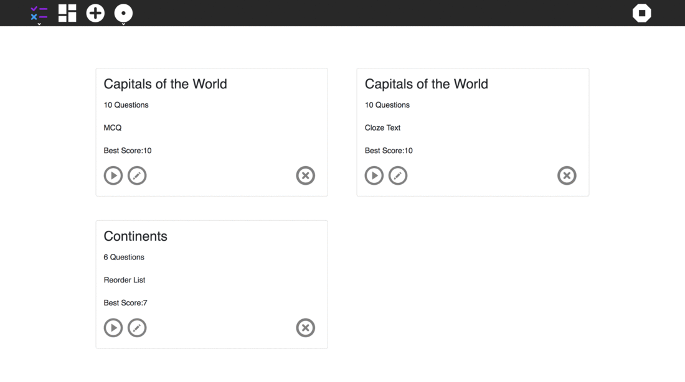

## Sugarizer Exerciser Activity

The Sugarizer Exerciser Activity is an Academic focused Activity for the Sugarizer Platform. It provides Teachers to build interactive Exercises for students, using multiple templates, and share them with their Students using the sugarizer-server.



This activity was developped by [Mankirat Singh](https://github.com/manki11) during GSoC 2018.
Learn more about this work on [Mankirat's blog](https://mankiratsinghtech.wordpress.com/2018/04/27/google-summer-of-code-2018/).

The Exerciser Activity is written using ReactJS framework. The ReactJS source code is maintain here and, once build, the code is integrated in [Sugarizer](https://github.com/llaske/sugarizer).

## Templates present in the application
1. **Multiple Choice Questions -**  
Build an exercise with questions and option choices. Here the user is supposed to select the correct answer to the question from a set of given options.
2. **Cloze Text -**  
Build an exercise with questions that have blanks to be filled. Here the user is supposed to fill in the blanks with the most appropriate answer.
3. **Reorder List -**  
Build an exercise with Jumbled Lists that need to be ordered.
4. **Group Assignment -**  
Build an exercise with questions that need to be placed in the correct group.
5. **Free text Input -**   
Build an exercise with questions that have answers in text format.
6. **Matching Pair -**  
Build an exercise to match questions with answers. Here the user is supposed to match one item in the left column to its corresponding item in the right column by connecting their two points.
7. **Word Puzzle -**  
Build a word puzzle to find answers to questions. Here the users discover hidden words by using hints given in the questions.

### Steps to run project

Make sure npm and nodejs are installed on your machine.

Clone the repository on your local machine and run.

```bash
npm install
```

#### Setting up the development environment

Copy the lib folder, inside the main directory of the project folder, into the node_modules folder (after npm install). These are dependencies required by the sugarizer platform.

```bash
mkdir node_modules/lib
cp -r lib/* node_modules/lib
```

#### Running the project

##### As a React App (No Sugarizer Features):

```bash
npm run start
```

##### As a Sugarizer Activity inside Sugarizer:
This step requires sugarizer. The steps to get Sugarizer working on your machine can be found here:
[Sugarizer](https://github.com/llaske/sugarizer)

###### Build the Activity

```bash
npm run build
```

The built activity can now be found inside the build folder.

###### Deploy Activity:

Copy the contents of the build folder and paste them inside the activity folder corresponding to Exerciser (/activities/Exerciser.activity), inside Sugarizer.

```
rm -rf ../sugarizer/activities/Exerciser.activity/*
cp -r build/* ../sugarizer/activities/Exerciser.activity
```

Restart Sugarizer.


## Contributing

1. Fork it
2. Create your feature branch (`git checkout -b feature/feature_name`)
3. Commit your changes (`git commit -am 'Add some feature'`)
4. Push to the branch (`git push origin feature/feature_name`)
5. Create a new Pull Request

## LICENSE

[](https://opensource.org/licenses/Apache-2.0)

This repository is Licensed under ```Apache v2``` license.
